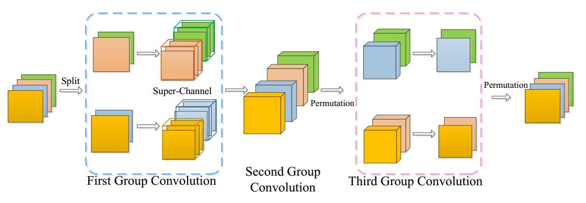

# MobileNet-V2 and IGCV3
An implementation of `Google MobileNet-V2` and `IGCV3` introduced in PyTorch. 
Link to the original paper: [Inverted Residuals and Linear Bottlenecks: Mobile Networks for Classification, Detection and Segmentation](https://arxiv.org/abs/1801.04381),IGCV3: Interleaved Low-Rank Group Convolutions for Efficient Deep Neural Networks. Ke Sun, Mingjie Li, Dong Liu, and Jingdong Wang. 
arXiv preprint [arXIV:1806.00178](https://arxiv.org/pdf/1806.00178.pdf) (2017)

This implementation was made to be an example of a common deep learning software architecture. It's simple and designed to be very modular. All of the components needed for training and visualization are added.


## Usage
This project uses Python 3.5.3 and PyTorch 0.3.

### Main Dependencies
 ```
 pytorch 0.3
 numpy 1.13.1
 tqdm 4.15.0
 easydict 1.7
 matplotlib 2.0.2
 tensorboardX 1.0
 ```

Install dependencies:
```bash
pip install -r requirements.txt
```

### Train and Test
1. Prepare your data, then create a dataloader class such as `cifar10data.py` and `cifar100data.py`.
2. Create a .json config file for your experiments. Use the given .json config files as a reference.

### Run
```
python main.py config/<your-config-json-file>.json
```

### Experiments
Due to the lack of computational power. I trained on CIFAR-10 dataset as an example to prove correctness, and was able to achieve test top1-accuracy of 90.9%.


#### Tensorboard Visualization
Tensorboard is integrated with the project using `tensorboardX` library which proved to be very useful as there is no official visualization library in pytorch.

You can start it using:
```bash
tensorboard --logdir experimenets/<config-name>/summaries
```

These are the learning curves for the CIFAR-10 experiment.

# IGCV3:Interleaved Low-Rank Group Convolutions for Efficient Deep Neural Networks.
The codes are based on https://github.com/liangfu/mxnet-mobilenet-v2.
>  IGCV3: Interleaved Low-Rank Group Convolutions for Efficient Deep Neural Networks. Ke Sun, Mingjie Li, Dong Liu, and Jingdong Wang. 
arXiv preprint [arXIV:1806.00178](https://arxiv.org/pdf/1806.00178.pdf) (2017)

## Prior Works

### Interleaved Group Convolutions ([IGCV1](https://arxiv.org/pdf/1707.02725.pdf))
Interleaved Group Convolutions use a pair of two successive interleaved group convolutions: primary group convolution and secondary group convolution. The two group convolutions are complementary.


>  Illustrating the interleaved group convolution, with L = 2 primary partitions and M = 3 secondary partitions. The convolution for each primary partition in primary group convolution is spatial. The convolution for each secondary partition in secondary group convolution is point-wise (1 × 1).

You can find its code [here](https://github.com/hellozting/InterleavedGroupConvolutions)!

### Interleaved Structured Sparse Convolution ([IGCV2](https://arxiv.org/pdf/1804.06202.pdf))
IGCV2 extends IGCV1 by decomposing the convolution matrix in to more structured sparse matrices, which uses a depth-wise convoultion (3 × 3) to replace the primary group convoution in IGC and uses a series of point-wise group convolutions (1 × 1).


## Interleaved Low-Rank Group Convolutions (IGCV3)
We proposes Interleaved Low-Rank Group Convolutions, named IGCV3, extend IGCV2 by using low-rank group convolutions to replace group convoutions in IGCV2. It consists of a channel-wise spatial convolution, a low-rank group convolution with <a href="https://www.codecogs.com/eqnedit.php?latex=G_{2}" target="_blank"></a> groups that reduces the width and a low-rank group convolution with <a href="https://www.codecogs.com/eqnedit.php?latex=G_{2}" target="_blank"></a> groups which expands the widths back.


>  Illustrating the interleaved branches in IGCV3 block. The first group convolution is a group 1 × 1 convolution with <a href="https://www.codecogs.com/eqnedit.php?latex=G_{2}" target="_blank"></a>=2 groups. The second is a channel-wise spatial convolution. The third is a group 1 × 1 convolution with <a href="https://www.codecogs.com/eqnedit.php?latex=G_{2}" target="_blank"></a>=2 groups.

## Results
### CIFAR Experiments
We compare our IGCV3 network with other Mobile Networks on CIFAR datasets which illustrated our model' advantages on small dataset.
#### Comparison with Other Mobile Networks
Classification accuracy comparisons of MobileNetV2 and IGCV3 on CIFAR datasets. "Network s×" means reducing the number of parameter in "Network 1.0×" by s times.
<table > 
<tr> <th width=250></th><th>#Params (M)</th> <th>CIFAR-10</th> <th> CIFAR100 </th> </tr> 
<tr> <th>MobileNetV2（our impl.）  </th><th> 2.3</th><th>94.56</th> <th>77.09</th></tr>
<tr> <th>IGCV3-D 0.5×  </th><th> 1.2</th><th>94.73</th> <th>77.29</th></tr>
<tr> <th>IGCV3-D 0.7× </th><th> 1.7</th><th>94.92</th> <th>77.83</th></tr>
<tr> <th>IGCV3-D 1.0× </th><th> 2.4</th><th>94.96</th> <th>77.95</th></tr>
<tr> <th>IGCV3-D 1.0×(my pytorch impl) </th><th> 2.4</th><th>94.70</th> <th>75.96</th></tr>
<tr> <th>MobileNetV2（my pytorch impl）  </th><th> 2.3</th><th>94.01</th> <th>--</th></tr>
</table>

#### Comparison with IGCV2
<table > 
<tr> <th width=100></th><th>#Params (M)</th> <th>CIFAR-10</th> <th> CIFAR100 </th> </tr> 
<tr> <th>IGCV2 </th><th> 2.4</th><th>94.76</th> <th>77.45</th></tr>
<tr> <th>IGCV3-D </th><th> 2.4</th><th>94.96</th> <th>77.95</th></tr>
</table>

### ImageNet Experiments
Comparison with MobileNetV2 on ImageNet.
#### Before Retrain
<table > 
<tr> <th width=100></th><th>#Params (M)</th> <th>Top-1</th> <th>Top-5</th> </tr> 
<tr> <th>MobileNetV2 </th><th> 3.4</th><th>70.0</th> <th>89.0</th></tr>
<tr> <th>IGCV3-D </th><th> 3.5</th><th>70.6</th> <th>89.7</th></tr>
</table>

#### After Retrain
<table > 
<tr> <th width=100></th><th>#Params (M)</th> <th>Top-1</th> <th>Top-5</th> </tr> 
 <tr> <th>MobileNetV2 </th><th> 3.4</th><th>71.4</th> <th>90.1</th></tr>
<tr> <th>IGCV3-D </th> <th> 3.5</th> <th>72.2</th> <th>90.5</th></tr>
</table>


# The code is maily from [IGCV3](https://github.com/homles11/IGCV3) and [MobilenetV2](https://github.com/MG2033/MobileNet-V2).Thanks for their contribution.
